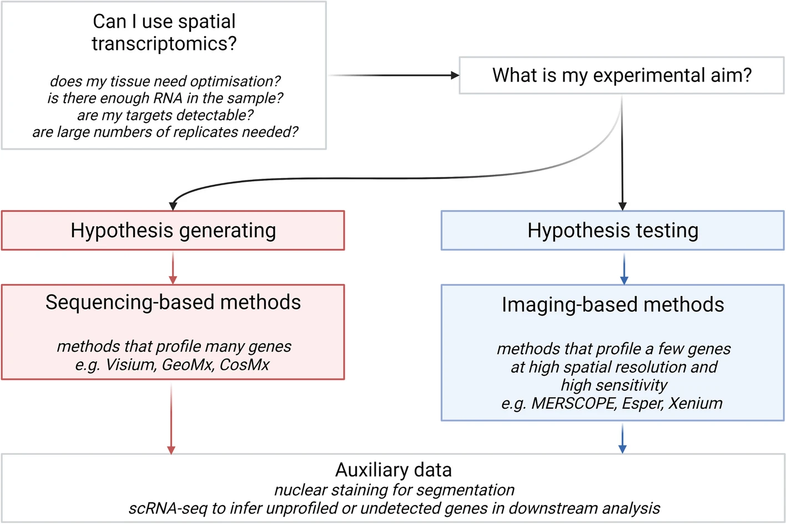
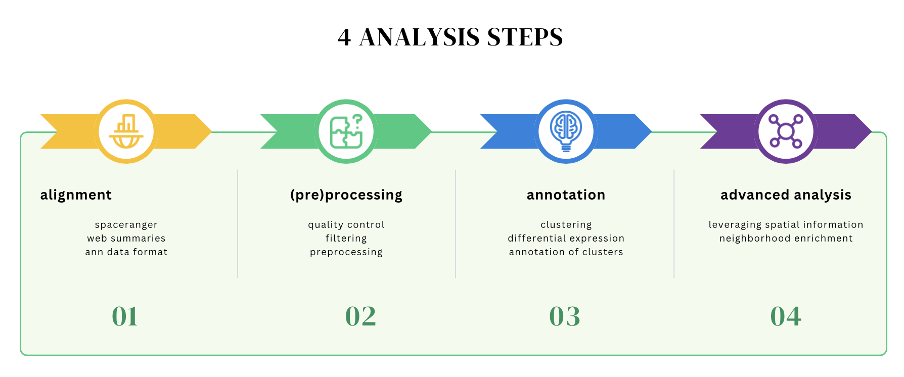
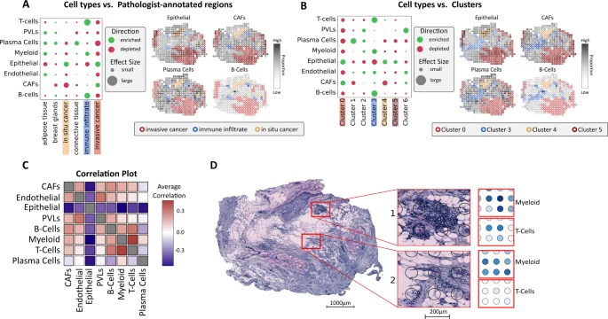
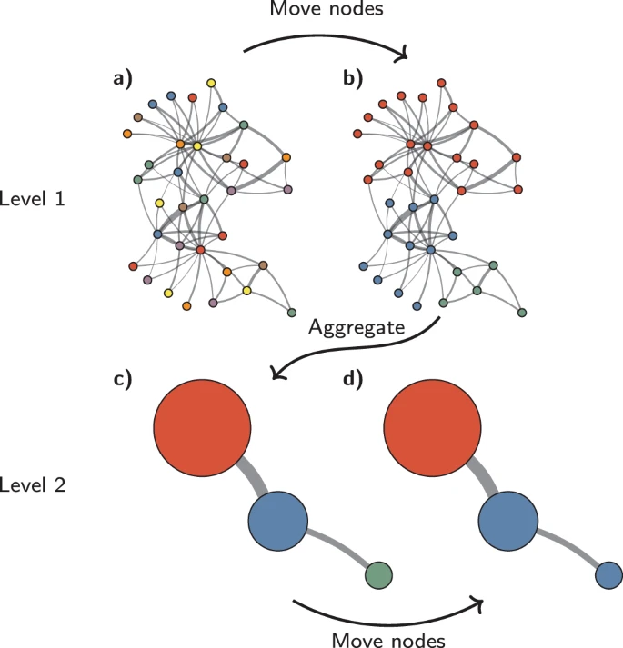
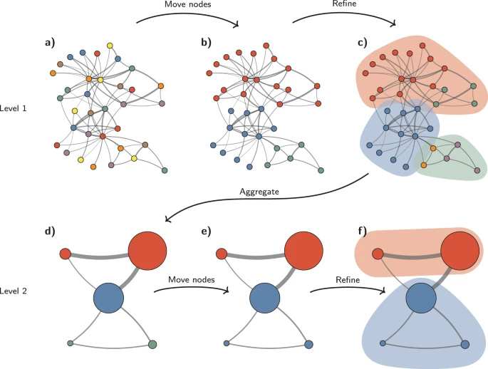

# Introduction:

Method of the year: [<u>https://www.nature.com/articles/s41592-020-01033-y</u>](https://www.nature.com/articles/s41592-020-01033-y)

Museum of spatial transcriptomics: [<u>https://www.nature.com/articles/s41592-022-01409-2</u>](https://www.nature.com/articles/s41592-022-01409-2)

Lundberg publications:
* [<u>https://www.nature.com/articles/s41592-020-01038-7</u>](https://www.nature.com/articles/s41592-020-01038-7)

* [<u>https://onlinelibrary.wiley.com/doi/full/10.1002/bies.201900221</u>](https://onlinelibrary.wiley.com/doi/full/10.1002/bies.201900221)

Overview paper of spatial transcriptomics: [<u>https://genomemedicine.biomedcentral.com/articles/10.1186/s13073-022-01075-1</u>](https://genomemedicine.biomedcentral.com/articles/10.1186/s13073-022-01075-1)

Scanpy publication:

[<u>https://genomebiology.biomedcentral.com/articles/10.1186/s13059-017-1382-0</u>](https://genomebiology.biomedcentral.com/articles/10.1186/s13059-017-1382-0)

Squidpy publication:

[<u>https://www.nature.com/articles/s41592-021-01358-2</u>](https://www.nature.com/articles/s41592-021-01358-2)

# Software:

- Provide structure for spatial data matrices and accessory data (e.g. UMAPs)

- functions for data visualizations, combining ST data with microscopy data

- standardized workflows for QC (filtering of poorly expressed genes), preprocessing, specialized techniques for ST

| **Function**                                                  | **R**        | **Python** |
|---------------------------------------------------------------|--------------|------------|
| both well documented and big user communities                 | Seurat       | Scanpy     |
| format                                                        | SeuratObject | anndata    |
| specialized workflows for spatial transcriptomics             | Giotto       | stLearn    |
| Spatially variable gene identification, cell cell interaction | semla        | squidpy    |

([<u>https://genomemedicine.biomedcentral.com/articles/10.1186/s13073-022-01075-1</u>](https://genomemedicine.biomedcentral.com/articles/10.1186/s13073-022-01075-1))

- [<u>Space Ranger</u>](https://support.10xgenomics.com/spatial-gene-expression/software/pipelines/latest/what-is-space-ranger)

  - Alignment of 10x spatial trancscriptomics data

- [<u>scanpy</u>](https://scanpy.readthedocs.io/en/stable/) (Python)

  - Preprocessing and analysis of spatial & single cell transcriptomics data

- [<u>anndata</u>](https://anndata.readthedocs.io/en/latest/) (Python)

  - Data Format for storing spatial & single cell transcriptomics data

- [<u>gseapy</u>](https://gseapy.readthedocs.io/en/latest/introduction.html)(Python)

  - Enrichment analysis toolkit

- [<u>squidpy</u>](https://squidpy.readthedocs.io/en/stable/) (Python)

  - Analysis and visualization of spatial transcriptomics data (Neighborhood enrichment, Cell-Cell-Communication, segmentation)

- [<u>Seurat</u>](https://satijalab.org/seurat/) (R)

  - Preprocessing and analysis of spatial & single cell transcriptomics data

- [<u>Giotto</u>](https://giottosuite.readthedocs.io/en/master/) (R)

  - Workflows for spatial transcriptomics analysis

- [<u>semla</u>](https://github.com/ludvigla/semla) (previously STUtility, R)

  - Preprocessing and analysis of spatial transcriptomics data

# Workflow:

## Alignment

- Depending on the sequencing kit

  - 10x Chromium: [<u>Space Ranger</u>](https://support.10xgenomics.com/spatial-gene-expression/software/pipelines/latest/what-is-space-ranger)

- Detailed tutorial at[<u>https://support.10xgenomics.com/spatial-gene-expression/software/pipelines/latest/tutorials/setup-spaceranger</u>](https://support.10xgenomics.com/spatial-gene-expression/software/pipelines/latest/tutorials/setup-spaceranger)

 

- Output can be read using scanpy: [<u>scanpy.read_visium</u>](https://scanpy.readthedocs.io/en/stable/generated/scanpy.read_visium.html)

## Preprocessing

- Include loading data, filtering, normalization and basic visualization

- [<u>https://scanpy-tutorials.readthedocs.io/en/latest/spatial/basic-analysis.html</u>](https://scanpy-tutorials.readthedocs.io/en/latest/spatial/basic-analysis.html)

- Filtering (most commonly used parameters), needs to selected for each dataset specifically

  - Total counts (sum of counts per cell,"total_counts")

  - Number of expressed genes per cell (n_genes_by_counts)

  - Number of cells per gene

- Several methods for filtering ([<u>standard</u>](https://scanpy.readthedocs.io/en/stable/generated/scanpy.pp.normalize_total.html), [<u>sctransform</u>](https://github.com/satijalab/sctransform), [<u>stLearn</u>](https://stlearn.readthedocs.io/en/latest/)) with standard being the most common:

  - normalize the expression matrix to a total sum of 10.000

  - Overview of methods: [<u>https://www.nature.com/articles/s41592-023-01814-1</u>](https://www.nature.com/articles/s41592-023-01814-1)

- Log-transformation (transforming data to approximately following a normal distribution)

- Dimensionality reduction using highly variable genes (HVG selection, PCA, UMAP)

## Clustering & Annotation

([<u>https://www.nature.com/articles/s41467-021-26271-2</u>](https://www.nature.com/articles/s41467-021-26271-2))

- Scanpy based tutorial: [<u>https://scanpy-tutorials.readthedocs.io/en/latest/spatial/basic-analysis.html#Manifold-embedding-and-clustering-based-on-transcriptional-similarity</u>](https://scanpy-tutorials.readthedocs.io/en/latest/spatial/basic-analysis.html#Manifold-embedding-and-clustering-based-on-transcriptional-similarity)

- Clustering (e.g. Leiden or Louvain)

  - needs resolution parameter which needs to be determined by the user

([<u>https://www.nature.com/articles/s41598-019-41695-z</u>](https://www.nature.com/articles/s41598-019-41695-z)
)

- Cluster annotation using:

  - known marker genes (dotplots, …)

  - cluster vs rest differential gene expression
     ([<u>scanpy.tl.rank_genes_groups</u>](https://scanpy.readthedocs.io/en/stable/generated/scanpy.tl.rank_genes_groups.html))

  - enrichment with cell marker databases
     ([<u>gseapy</u>](https://gseapy.readthedocs.io/en/latest/introduction.html)
     with dbs: [<u>Azimuth</u>](https://azimuth.hubmapconsortium.org/),
     [<u>CellMarker</u>](http://biocc.hrbmu.edu.cn/CellMarker/),
     [<u>PanglaoDB</u>](https://panglaodb.se/))

- Often one spot contains more than one cell type -\> niches

## Neighbor​​hood enrichment

- Main question: Does a specific cell type appear often close to another cell type ?

- Analysis of the spatial neigborhood graph

- used for example in:
  [<u>Palla et al. (2022)</u>](https://www.nature.com/articles/s41592-021-01358-2),
  [<u>Tosti et al. (2021)</u>](https://www.sciencedirect.com/science/article/pii/S0016508520353993)

- Multiple ways:

  - Neighborhood enrichment

    - Question: how often are cell types/niches next to each other?

    - [<u>https://squidpy.readthedocs.io/en/stable/notebooks/tutorials/tutorial_vizgen_mouse_liver.html#neighborhood-enrichment</u>](https://squidpy.readthedocs.io/en/stable/notebooks/tutorials/tutorial_vizgen_mouse_liver.html#neighborhood-enrichment)

  - Spatial Co-occurence

    - How often and at which distance are other cell types/niches located?

    - [<u>https://squidpy.readthedocs.io/en/stable/notebooks/examples/graph/compute_co_occurrence.html</u>](https://squidpy.readthedocs.io/en/stable/notebooks/examples/graph/compute_co_occurrence.html)

  - Network centrality

    - Classical graph based measures for neighborhood information

    - [<u>https://squidpy.readthedocs.io/en/stable/notebooks/examples/graph/compute_centrality_scores.html</u>](https://squidpy.readthedocs.io/en/stable/notebooks/examples/graph/compute_centrality_scores.html)

    - [<u>https://squidpy.readthedocs.io/en/stable/notebooks/tutorials/tutorial_vizgen_mouse_liver.html#network-centrality-scores</u>](https://squidpy.readthedocs.io/en/stable/notebooks/tutorials/tutorial_vizgen_mouse_liver.html#network-centrality-scores)

